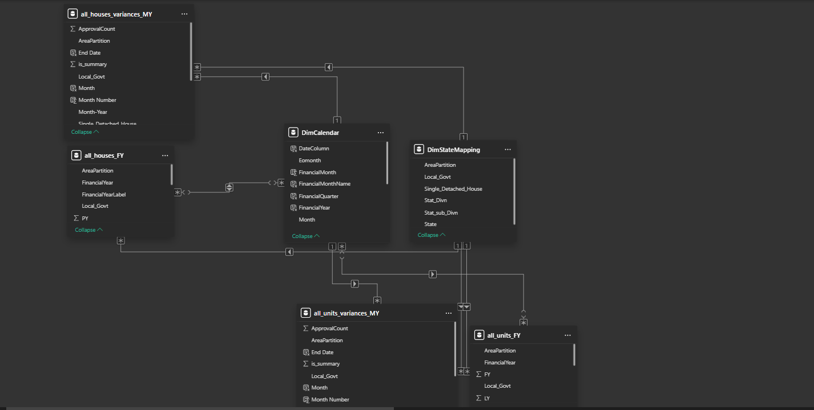

# 🏘️ House and Units Approvals Analytics Reporting
### Automated Insights with Azure SQL & Power BI

This Power BI project provides automated insights into house and unit approvals using data backed by **Azure SQL Server**. The report is designed to help planners, analysts, and authorities track approval trends, monitor authority performance, and explore property-specific statistics with interactive dashboards.

---

## 📌 Project Highlights

- 🔗 **Azure SQL Integration** – Live data from Azure SQL ensures reliable, up-to-date reports.
- 📊 **Power BI Dashboards** – Intuitive reports for approvals, trends, and property insights.
- 📐 **Data Modeling** – Clean and optimized star schema structure.
- 🔄 **Automated Refresh** – Scheduled updates for always-fresh data.
- 🌍 **Geo Analysis** – Regional breakdowns of housing trends.

---

## 📐 Data Model

A clean star schema was designed with:
A central fact table containing the house and unit approvals.

Dimension tables for:

Date/Time

Regions

Authorities

Property Types

It supports optimized querying, clean relationships, and effective report filtering in Power BI.

📷 *Data Model Overview:*

---

## 📊 Dashboard Views

### ✅ House Approvals Dashboard
Shows total house approvals by authority and region, with monthly trends and property types.

---

### 🏢 Unit Approvals Dashboard
Breakdown of multi-unit vs single-unit approvals with KPIs and timeline visuals.

---

### 📈 Approval Trend Analysis
Visualizes approval patterns over time using slicers by year and authority.

---

## ⚙️ Technologies Used

- **Power BI Desktop**
- **Azure SQL Server** (data source)
- **DAX & Power Query** for calculations and transformations
- **Power BI Service** (for scheduled refreshes)

---

## 🎯 How to Use

1. Clone this repository.
2. Open `House Approvals Analytics Dashboard1v.pbix` in Power BI Desktop.
3. Update the data source to connect to your Azure SQL Server.
4. Publish to Power BI Service (optional) and configure a scheduled refresh.
5. Use slicers and filters to explore the data by region, type, and time.

---

## 📈 Insights You Can Derive

- Which authorities approve the most units?
- How has the approval volume changed over time?
- Are single-unit or multi-unit properties more common?
- What regions have faster or delayed approval trends?

---

